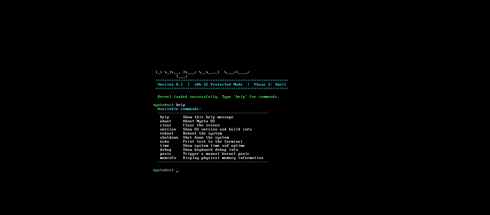

<p align="center">  </p>

<h1 align="center">Nyota OS</h1>

<p align="center">  <strong>A hobby operating system built from scratch.</strong></p>

<p align="center">  Exploring boot processes, low-level programming, kernel development,  and operating system fundamentals.</p>

<p align="center">        </p>

<p align="center">  <a href="#getting-started">Getting Started</a>  ·  <a href="#architecture">Architecture</a>  ·  <a href="#roadmap">Roadmap</a></p>

---

### A Hobby Operating System Built From Scratch

**Nyota OS** is an experimental hobby operating system developed from the ground up to explore low-level programming, boot processes, operating system fundamentals, and direct interaction with computer hardware.

The project is written primarily in **C and Assembly** and is built using a Linux/WSL development environment. The resulting bootable image can be tested using **QEMU**.

> **Nyota** means "star" in Swahili, representing the goal of exploring the lower layers of computing one step at a time.

---

<p align="center">

<a href="#getting-started"></a><a href="#architecture"></a><a href="#roadmap"></a>

</p>

<p align="center">


</p>

---

## 📸 Project Preview

> Add a screenshot of Nyota OS running in QEMU here.

```textdocs/└── nyota-os-qemu.png```

Example:



---

# 🧠 What Is Nyota OS?

Nyota OS is a **from-scratch operating system project** created to understand what happens underneath applications and modern operating systems.

Instead of relying on an existing operating system kernel, the project explores the fundamentals involved in creating a bootable system.

The project focuses on understanding concepts such as:

* Boot processes* Low-level programming* Assembly* C at the system level* Kernel development* Hardware interaction* Memory* Computer architecture* Build systems* Emulator-based operating system development

The project is intentionally experimental and will evolve as new operating system concepts are implemented.

---

# ✨ Current Features

Nyota OS currently includes the foundations required to produce and boot the operating system image.

### Current Capabilities

* 🥾 Bootable operating system image* ⚙️ Custom low-level code* 🧠 C-based system development* 🔧 x86 Assembly* 🔗 Custom linking/build process* 💾 Bootable disk image generation* 🖥️ QEMU-based execution* 🐧 Linux/WSL development environment

> Nyota OS is an ongoing project. Features will be added incrementally as development continues.

---

# 🏗️ Architecture

At a high level, Nyota OS follows a simple low-level execution path:

```text┌──────────────────────┐│      Computer        │└──────────┬───────────┘           │           ▼┌──────────────────────┐│      Boot Process    ││      Assembly        │└──────────┬───────────┘           │           ▼┌──────────────────────┐│      Kernel          ││      C + Assembly    │└──────────┬───────────┘           │           ▼┌──────────────────────┐│ Hardware / Memory /  ││ System Interfaces    │└──────────────────────┘```

The architecture will become more sophisticated as additional kernel and hardware functionality is implemented.

---

# 🛠️ Development Environment

Nyota OS is currently developed and tested using:

| Tool             | Purpose                    || ---------------- | -------------------------- || **C**            | Kernel/system programming  || **x86 Assembly** | Low-level and boot code    || **NASM**         | Assembler                  || **GCC**          | C compilation              || **GNU LD**       | Linking                    || **GNU objcopy**  | Binary/image generation    || **GNU Make**     | Build automation           || **QEMU**         | Operating system emulation || **Linux / WSL2** | Development environment    |

---

# 📋 Prerequisites

Before building Nyota OS, install the required development tools.

On Debian/Ubuntu-based Linux or WSL:

```bashsudo apt update```

Install the basic toolchain:

```bashsudo apt install build-essential nasm binutils make qemu-system-x86```

Verify the installations:

```bashgcc --versionnasm --versionld --versionobjcopy --versionmake --versionqemu-system-i386 --version```

You should see version information for each tool.

---

# 🚀 Getting Started

Nyota OS is developed using Linux-based tools such as GCC, NASM, Make, Binutils, and QEMU.

If you are using Windows, the recommended setup is WSL2 (Windows Subsystem for Linux). This allows the Linux development toolchain to run inside Windows while keeping the project workflow close to a normal Linux environment.

## 🪟 Windows + WSL2

1. Install or update WSL

Open PowerShell as Administrator and run:

```powershellwsl --update```

Check your WSL installation:

```powershellwsl --status```

Check your installed Linux distributions and confirm they are using WSL2:

```powershellwsl -l -v```

The VERSION column should show:

```text2```

2. Open WSL

From PowerShell:

```powershellwsl```

Your terminal will now be inside your Linux environment.

3. Install the Nyota OS toolchain

Inside WSL:

```bashsudo apt updatesudo apt install build-essential nasm binutils make qemu-system-x86```

Verify the tools:

```bashgcc --versionnasm --versionld --versionobjcopy --versionmake --versionqemu-system-i386 --version```

## 4. Clone the repository

Inside WSL:

```bashgit clone https://github.com/YOUR_USERNAME/nyota-os.gitcd nyota-os```

If you already cloned the repository on Windows, you can access it from WSL through /mnt/.

For example, a Windows path such as:

```textC:\Users\YourName\Projects\nyota-os```

becomes:

```bashcd /mnt/c/Users/YourName/Projects/nyota-os```

## 5. Build Nyota OS

From the Nyota OS project directory:

```bashmake```

The Makefile compiles the required C and Assembly components and generates the bootable image.

If the build succeeds, you should have the generated Nyota OS image in the project directory.

## 6. Run Nyota OS with QEMU

Start the generated image with:

```bashqemu-system-i386 -drive format=raw,file=nyota.img```

If the generated image has a different filename, replace nyota.img with the correct filename.

A QEMU window should open and boot Nyota OS.

## ⚡ Quick Build & Run

Once WSL and the required tools are installed:

```bashcd /path/to/nyota-osmakeqemu-system-i386 -drive format=raw,file=nyota.img```

## 🪟 Running from Windows PowerShell

You can also run WSL commands directly from PowerShell.

For example:

```powershellwsl bash -lc "cd /mnt/c/Users/YourName/Projects/nyota-os && make"```

To build and launch QEMU:

```powershellwsl bash -lc "cd /mnt/c/Users/YourName/Projects/nyota-os && qemu-system-i386 -drive format=raw,file=nyota.img"```

For multiple commands, entering WSL with:

```powershellwsl```

and working directly inside the Linux shell is usually easier.

## 🖥️ If QEMU Does Not Open a Graphical Window

QEMU's graphical window on Windows through WSL depends on WSLg.

First update WSL from an Administrator PowerShell:

```powershellwsl --update```

Then restart WSL:

```powershellwsl --shutdown```

Open WSL again:

```powershellwsl```

Then retry:

```bashqemu-system-i386 -drive format=raw,file=nyota.img```

If it still fails, verify that your Linux distribution is running under WSL2:

```powershellwsl -l -v```

## ⚠️ Safety

Nyota OS is experimental.

Do not write nyota.img directly to a physical disk or USB drive unless you fully understand the command and its consequences.

Use QEMU for development and testing. It provides a virtual environment where Nyota OS can be safely booted without modifying your host operating system.

# 🖥️ Running Nyota OS

A successful launch should boot the generated Nyota OS image inside QEMU.

```textHost Operating System│▼QEMU│▼nyota.img│▼Boot Process│▼Nyota OS```

QEMU allows development and testing without installing Nyota OS directly onto physical hardware.

**Do not write experimental OS images directly to a physical disk unless you fully understand the consequences.**

📁 Project Structure**

The exact structure may evolve as the operating system grows.

A typical structure is:

```textnyota-os/│├── boot/              # Boot-related code│├── kernel/            # Kernel implementation│├── src/               # C source files│├── include/           # Header files│├── Makefile           # Build automation│├── linker.ld          # Linker script│├── README.md│└── .gitignore```

Generated build artifacts should not be committed to the main source tree.

---

# 🔬 Development Philosophy

Nyota OS is being developed primarily as a **learning and experimentation project**.

The goal is not to immediately reproduce Linux or another production operating system.

Instead, development follows a gradual approach:

```textBoot │ ▼Low-Level Initialization │ ▼Kernel │ ▼Memory │ ▼Interrupts │ ▼Hardware Interaction │ ▼Drivers │ ▼Processes │ ▼File System │ ▼User Space```

Each stage provides a deeper understanding of how operating systems interact with hardware.

---

# 🗺️ Roadmap

Nyota OS is an ongoing project.

### Phase 1 — Boot Foundation

* [x] Bootable image* [x] Assembly boot code* [x] Basic build pipeline* [x] QEMU boot testing

### Phase 2 — Kernel Foundation

* [x] Kernel entry* [x] C-based kernel development* [x] Linker configuration* [x] Kernel/image integration

### Phase 3 — System Interaction

* [x] Initial system interaction* [ ] Keyboard input improvements* [ ] Interrupt handling* [ ] IDT* [ ] GDT improvements

### Phase 4 — Memory

* [ ] Memory map* [ ] Physical memory management* [ ] Heap* [ ] Paging* [ ] Virtual memory

### Phase 5 — Hardware

* [ ] Keyboard driver* [ ] Timer* [ ] VGA/framebuffer improvements* [ ] Device abstractions

### Phase 6 — Processes

* [ ] Process management* [ ] Context switching* [ ] Scheduling* [ ] User/kernel separation

### Phase 7 — Storage

* [ ] File-system design* [ ] Disk abstraction* [ ] File operations

### Phase 8 — User Space

* [ ] System calls* [ ] Shell* [ ] Basic user programs* [ ] User-space memory

> Roadmap items are experimental goals and may change as the project evolves.

---

# 🧪 Testing

Nyota OS is primarily tested through QEMU.

Build:

```bashmake```

Run:

```bashqemu-system-i386 -drive format=raw,file=nyota.img```

The emulator provides a safe environment for testing boot and kernel changes without modifying the host operating system.

---

# 🧰 Build Commands

Common commands:

```bash# Buildmake

# Clean generated filesmake clean

# Build againmake clean && make```

If additional Makefile targets are available, they should be documented here.

---

# 📷 Screenshots

Screenshots and development captures will be added as the project evolves.

Recommended:

```textdocs/├── boot.png├── qemu.png├── kernel.png└── architecture.png```

---

# 🎯 Project Goals

Nyota OS exists to answer a simple question:

> **What actually happens between turning on a computer and running software?**

Through building the system from the ground up, the project explores:

* How machines boot* How processors execute instructions* How C interacts with hardware* How Assembly fits into system software* How kernels are structured* How memory is managed* How hardware communicates with software* How operating systems provide abstractions

---

# 🔐 Security Perspective

Because Nyota OS is part of a broader cybersecurity and systems-learning journey, the project also provides a foundation for understanding security at a lower level.

Future areas of exploration may include:

* Memory isolation* Privilege levels* Kernel attack surfaces* Secure boot concepts* Process isolation* System-call security* Memory corruption* Hardware security boundaries

These areas will be explored as the operating system becomes more capable.

---

# ⚠️ Disclaimer

Nyota OS is an **experimental educational operating system project**.

It is not intended to replace a production operating system and should not be considered production-ready.

Run the system inside an emulator such as **QEMU** during development.

Do not install experimental builds directly onto important physical storage devices.

---

# 🤝 Contributing

Nyota OS is primarily a personal learning project, but ideas, discussions, and educational contributions are welcome.

If you find an issue or have an interesting idea:

1. Open an issue.2. Explain the problem or proposal.3. Include reproduction steps where applicable.4. Provide relevant logs or screenshots.

Pull requests should remain focused and clearly documented.

---

# 📚 Learning Resources

Nyota OS development involves concepts from:

* Operating systems* Computer architecture* C programming* Assembly programming* x86 architecture* Linkers and loaders* Boot processes* Kernel development

The project itself is intended to be a practical way of learning these concepts rather than simply reading about them.

---

# 👨‍💻 Author

**Sahil**

Computer Science Engineering StudentCybersecurity

Interested in:

**Cybersecurity • Software Engineering • Systems • Networking • Low-Level Programming**

---

<p align="center">

**Built from the ground up. One instruction at a time.**

</p>

---

<p align="center">

⭐ If you find Nyota OS interesting, consider starring the repository.

</p>